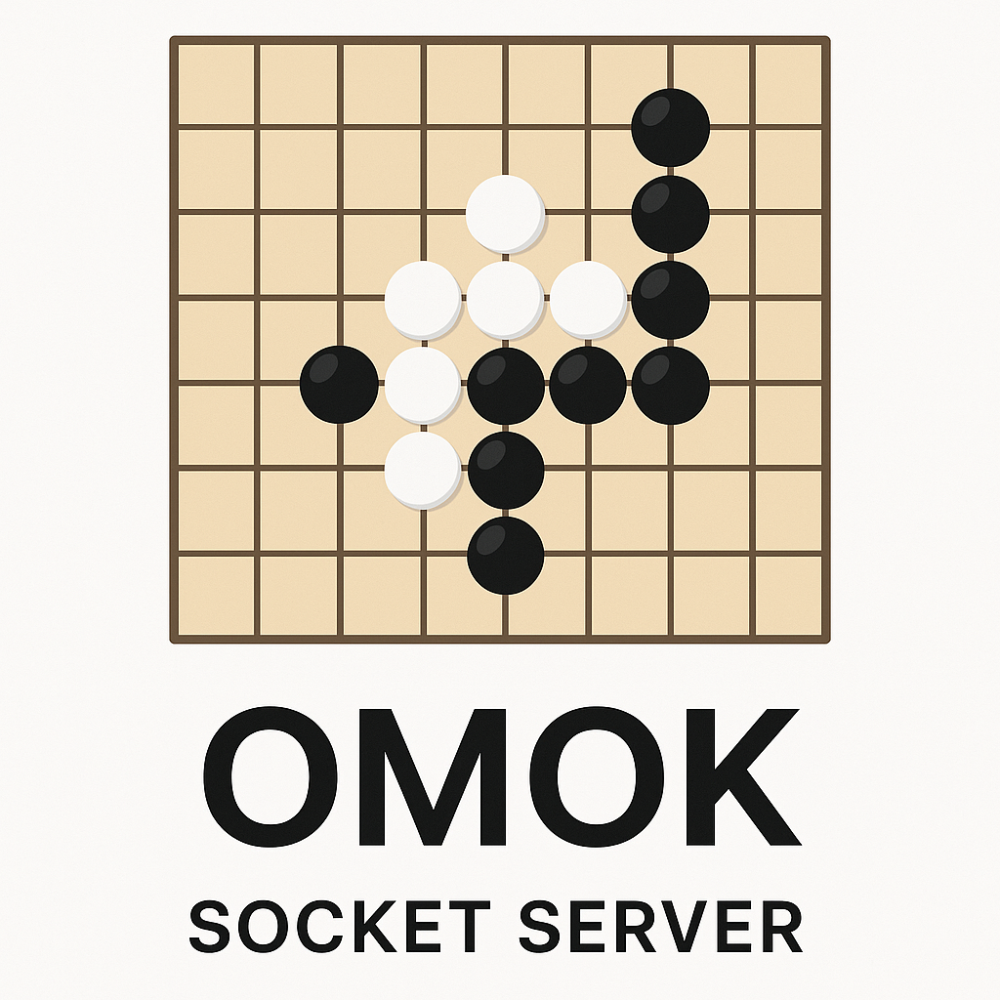
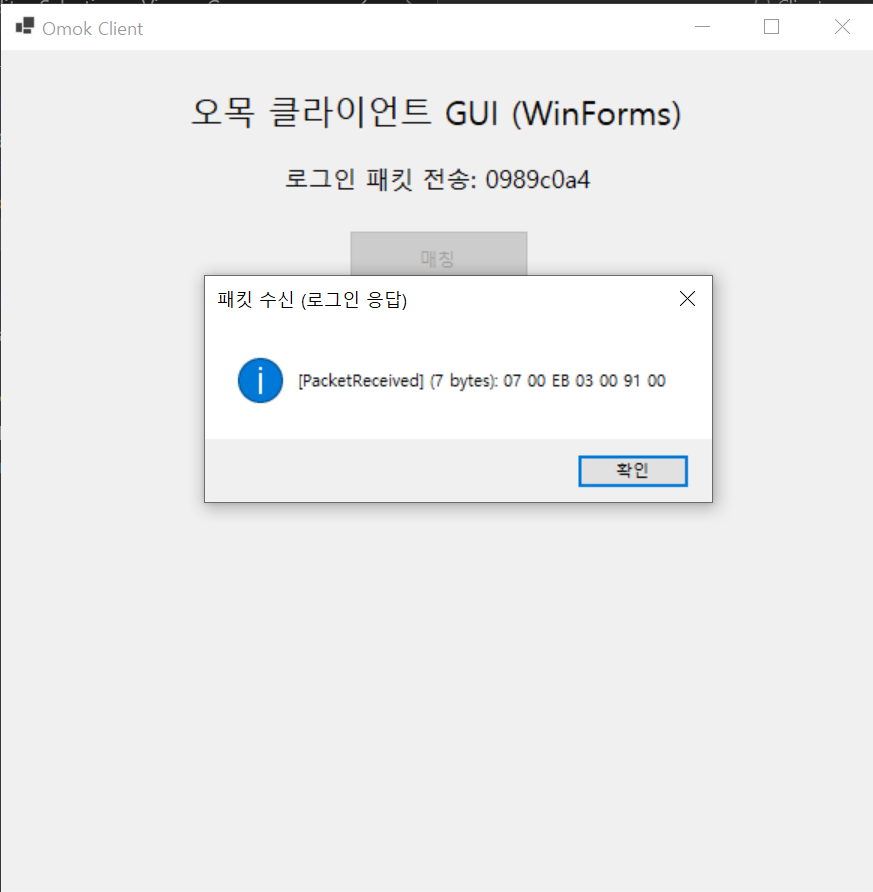
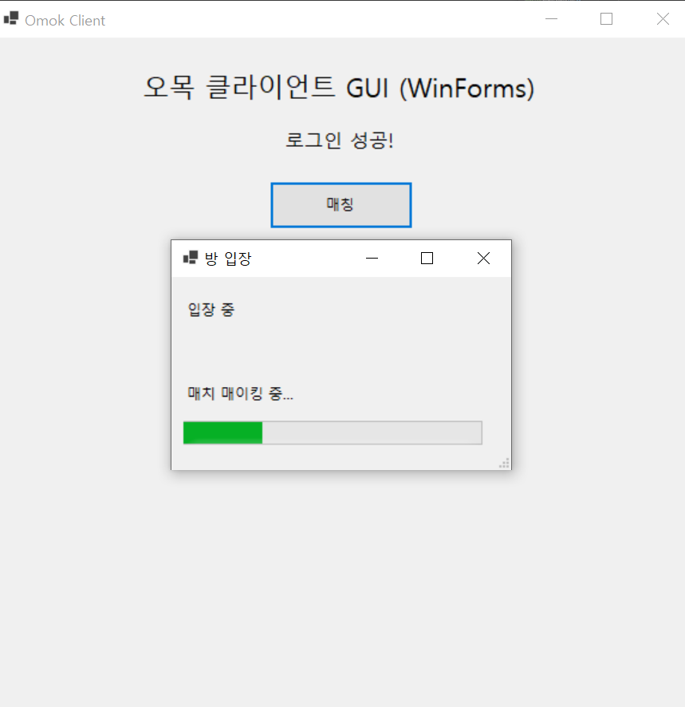
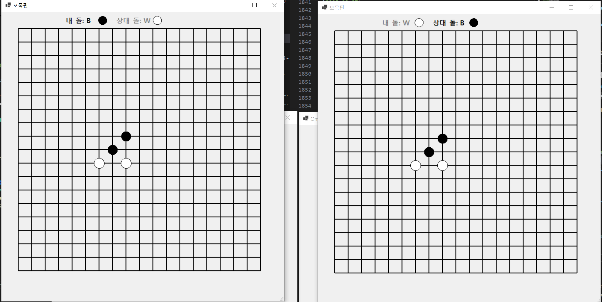
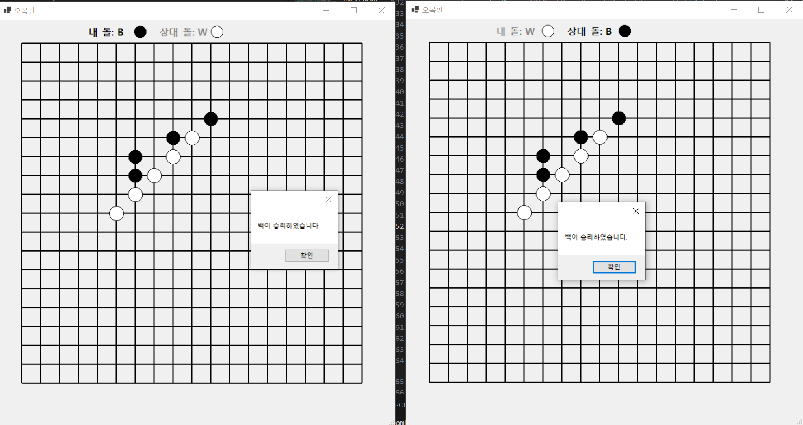

# OmokSocketServer 프로젝트

## 개요
- .NET 9.0 기반 오목 네트워크 게임 프로젝트입니다.
- 서버(`SocketServer/`)는 SuperSocketLite로 TCP 통신만 담당하는 콘솔 앱입니다.
- 클라이언트(`Client/`)는 WinForms 기반 GUI로 오목 게임을 구현합니다.

## 폴더 구조
- `SocketServer/` : 서버 코드 (SuperSocketLite 기반)
- `Client/` : 클라이언트 코드 (WinForms 기반)
- `ReadMe.md` : 프로젝트 설명 및 체크리스트

## 플레이 방식 (로컬 기반 설명)
- SocketServer 폴더에서 Dotnet Run
- Client 폴더를 두개로 복제.
- Client 폴더에서 Dotnet Run 
- Client(1) 폴더에서 Dotnet Run
- Client 모두 매칭 버튼 클릭
- 결과 확인

## 특이사항 (바이브 코딩)
- **서버:**
  - 바이브 코딩 활용 비율 = **(직접 코딩) 7** : (바이드 코딩 이용) 3
  - 바이브 코딩 시, 사용한 기능은 다음과 같습니다.
    - 코드 자동 완성 기능
    - 명칭 추천
    - 아키텍쳐 추천
    - 궁금한 점 질의 응답
- **클라이언트:**
  - 바이브 코딩 활용 비율 = (직접 코딩) 3 : **(바이드 코딩 이용) 7**
  - 바이브 코딩 시, agent 모드로 대부분의 코드를 작성하였습니다.
  - 사유 : 윈폼에 대한 지식 부족 및, 코딩 시간 단축 (퀄리티보다는 일단 렌더링 가능하게)

---

## 플레이 UI

아래는 실제 클라이언트 플레이 과정에서의 주요 UI 화면 예시입니다.

<table>
  <tr>
    <td align="center">
       
      <b>1. 로그인 화면</b> 
      사용자가 닉네임 등 정보를 입력하고 서버에 접속합니다.
    </td>
    <td align="center">
       
      <b>2. 매치메이킹 화면</b> 
      매칭 큐에 들어가 상대방을 기다리는 화면입니다.
    </td>
  </tr>
  <tr>
    <td align="center">
       
      <b>3. 플레이(오목판) 화면</b> 
      오목판에서 돌을 두며 실시간으로 게임이 진행됩니다.
    </td>
    <td align="center">
       
      <b>4. 결과 화면</b> 
      게임 종료 후 승패 결과 및 후처리 안내가 표시됩니다.
    </td>
  </tr>
</table>

---

## 클래스 다이어그램

'''mermaid
classDiagram
    %% SuperSocket 기본 클래스들
    class AppServer~ClientSession, EFBinaryRequestInfo~
    class AppSession~ClientSession, EFBinaryRequestInfo~
    class IRequestInfo
    
    %% 서버 관련 클래스
    class MainServer {
        +static ILog s_MainLogger
        +static ServerOption s_ServerOption
        +IServerConfig _config
        +PacketProcessor _mainPacketProcessor
        +RoomManager _roomManager
        +UserManager _userManager
        +MainServer()
        +InitConfig(ServerOption)
        +CreateServer()
        +InitLogger()
        +InitManagers()
        +InitComponent() ErrorCode
        +SendData(string, byte[]) bool
        +Distribute(ServerPacketData)
        -OnConnected(ClientSession)
        -OnClosed(ClientSession, CloseReason)
        -OnPacketReceived(ClientSession, EFBinaryRequestInfo)
        +GetSessionCount() int
        +StopServer()
    }
    
    class ClientSession {
    }
    
    class EFBinaryRequestInfo {
        +int PacketSize
        +int PacketID
        +short Dummy
        +byte[] Body
        +int TotalSize
    }
    
    class ReceiveFilter
    
    %% 패킷 처리 관련 클래스
    class PacketProcessor {
        -bool _isThreadRunning
        -Thread _processThread
        +BufferBlock~ServerPacketData~ _packetBuffer
        +Dictionary~int, Action~ _packetHandlerMap
        -UserManager _userManager
        -RoomManager _roomManager
        -ConnectionHandler _connectionHandler
        -RoomHandler _roomHandler
        +Create(MainServer)
        +Start()
        +Destroy()
        +PushPacket(ServerPacketData)
        -Process()
        -RegisterPacketHandlers(Func, Action, Func)
    }
    
    class ServerPacketData {
        +string SessionID
        +int PacketSize
        +int PacketID
        +short Dummy
        +byte[] BodyData
        +static MakeNTFInConnectOrDisConnectClientPacket(bool, string)
    }
    
    %% 핸들러 관련 클래스
    class HandlerBase {
        #Func~string, byte[], bool~ NetSendFunc
        #Action~ServerPacketData~ DistributeFunc
        #Func~int~ GetSessionCountFunc
        #UserManager _userManager
        #RoomManager _roomManager
        +abstract RegisterPacketHandler(Dictionary~int, Action~)
        +Init(Func, Action, Func, UserManager, RoomManager)
    }
    
    class ConnectionHandler {
        +RegisterPacketHandler(Dictionary~int, Action~)
        +HandleLogin(ServerPacketData)
        +SendResponseToClient(ErrorCode, string, string)
    }
    
    class RoomHandler {
        +RegisterPacketHandler(Dictionary~int, Action~)
        +HandleRequestRoomEnter(ServerPacketData)
        +HandleRequestRoomLeave(ServerPacketData)
        +HandleRequestMoveStone(ServerPacketData)
        +HandleRequestMatchMake(ServerPacketData)
    }
    
    %% 관리자 클래스
    class RoomManager {
        +List~Room~ _roomList
        +List~(string, string)~ _matchWaitingQueue
        +CreateRooms()
        +GetRoom(int)
        +GetEmptyRoom()
    }
    
    class UserManager {
        +Dictionary~string, User~ _userSessionDic
        +Dictionary~string, User~ _userIdDic
        +Init(int)
        +GetUser(string)
        +AddUser(string, string)
        +RemoveUser(string)
    }
    
    %% 게임 상태 관련 클래스
    class Room {
        +int Number
        +int Turn
        +bool IsGameStart
        +static Func~string, byte[], bool~ NetSendFunc
        +AddUser(string, string)
        +RemoveUser(RoomUser)
        +PlayerMove(int, int)
        +SendNotifyPlayerMove(int, int, bool, char)
        +InitializeGameStatus()
        +GetPlayerColor(string)
    }
    
    class User {
        +string UserID
        +string SessionID
        +int RoomNumber
        +bool IsConfirm(string)
        +bool IsStateRoom()
        +void EnteredRoom(int)
        +void LeaveRoom()
    }
    
    class RoomUser {
        +string UserID
        +string NetSessionID
        +void Set(string, string)
    }
    
    %% 게임 로직 관련 클래스
    class OmokRule {
        +CheckWinCondition(OmokBoard, int, int)
    }
    
    class OmokBoard {
        +int[,] Board
        +PlaceStone(int, int, int)
        +Initialize()
    }
    
    %% 설정 관련 클래스
    class ServerOption {
        +string Name
        +int Port
        +int MaxRequestLength
        +int MaxConnectionNumber
        +int RoomMaxCount
        +int RoomMaxUserCount
    }
    
    class ErrorCode {
        +None
        +RoomEnterInvalidRoomNumber
        +RoomEnterAlreadyUser
        +RoomEnterFullRoom
        +RoomEnterInvalidUser
        +RoomEnterInvalidState
    }
    
    %% 클래스 간의 관계
    AppServer <|-- MainServer
    AppSession <|-- ClientSession
    IRequestInfo <|-- EFBinaryRequestInfo
    
    MainServer *-- PacketProcessor
    MainServer *-- RoomManager
    MainServer *-- UserManager
    MainServer --> ClientSession
    
    RoomManager *-- Room
    UserManager *-- User
    
    Room *-- RoomUser
    Room *-- OmokBoard
    Room *-- OmokRule
    
    PacketProcessor --> ConnectionHandler
    PacketProcessor --> RoomHandler
    PacketProcessor --> ServerPacketData: processes
    PacketProcessor o-- UserManager
    PacketProcessor o-- RoomManager
    
       %% 관계 정의
    HandlerBase <|-- ConnectionHandler
    HandlerBase <|-- RoomHandler
    
    MainServer --> ServerOption

--

# 체크리스트 (개발 순서)

## 0. 학습
- ✅ Echo서버 코드 분석
- ✅ [.NET Conf 2023 x Seoul] Hands-on-Lab: Echo Server 영상 시청
- ✅  chat서버 코드 분석

## 1. 기본 뼈대 구축
### 서버 구축
- ✅  chat 서버 코드를 기반으로, 서버 코드 뼈대 구축
- ✅  MainServer.cs , 패킷 처리기 구축
- ✅  room, room manager 구축 
- ✅  매칭 시스템 구축 (매칭 큐)

### 클라이언트 구축
- ✅ (바이브 코딩 + WinForm)을 이용하여 기본 클라이언트 뼈대 구축
- ✅ 오목판 Winform을 이용한 GUI 구축

### 클라-서버 테스트
- ✅ 서버-클라이언트 통신 테스트 (매칭 큐 테스트)

## 2. 게임 로직 (룰) 추가 및 프로토 타입 완성
- ✅ 서버 : 오목 게임 관련 로직 추가(게임 상태 관리) , 승리 조건 확인
- ✅ 클라이언트: 게임 진행 실시간 렌더링 로직 추가
- ✅ 프로토 타입 게임 테스트
- ✅ 게임 결과 및 후처리 로직 추가 (서버 , 클라이언트)

## 3. 코드 리팩토링 , 예외/에러 처리 및 유지보수 
- ⬜ 코드 리뷰 후, 필요한 부분 리팩토링
- ⬜ 디렉토리 구조 정리
- ⬜ 문서 정리 (시퀀스 다이어그램, 클래스 다이어그램 작성)

## 4. 예외/에러 처리 및 유지보수 
- ⬜ 예외/에러 핸들링 및 사용자 알림
- ⬜ 주석 및 코드 정리

## 5. 추가 기능 (시간이 남는 경우)
- ⬜ 채팅 기능 추가
- ⬜ 게임 방 기능 추가

---
